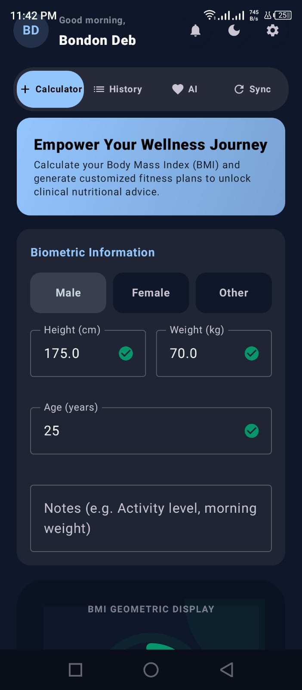
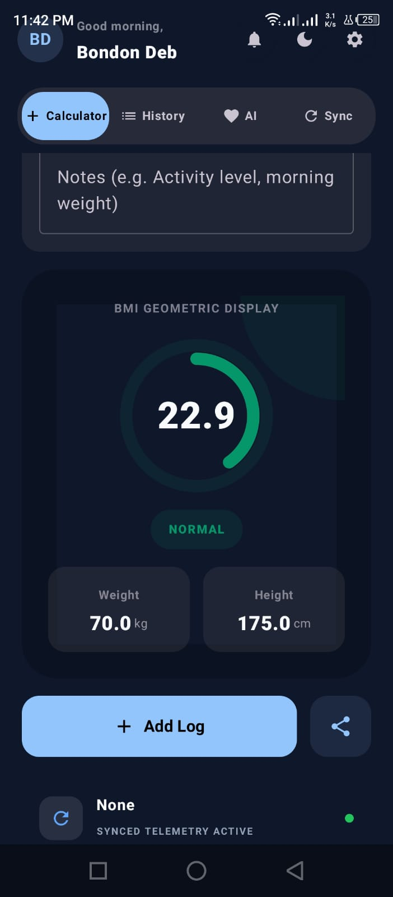
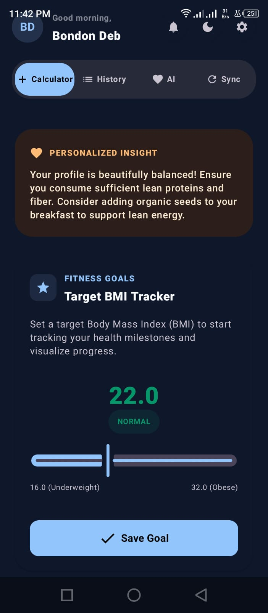
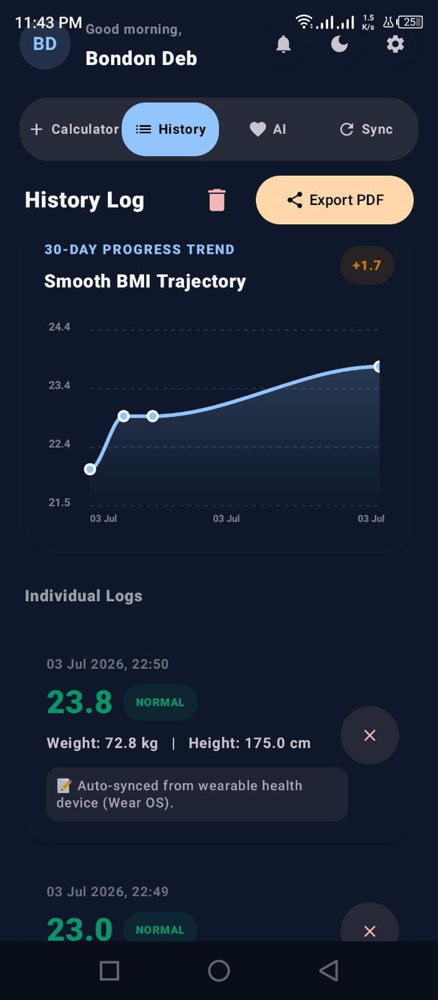
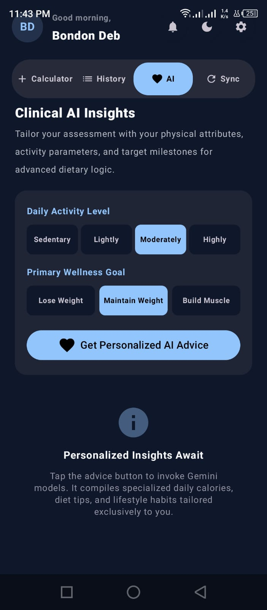
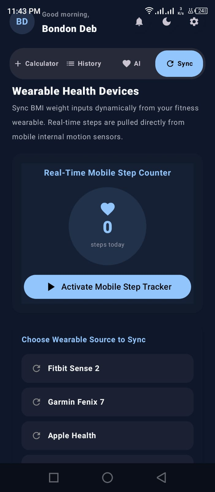
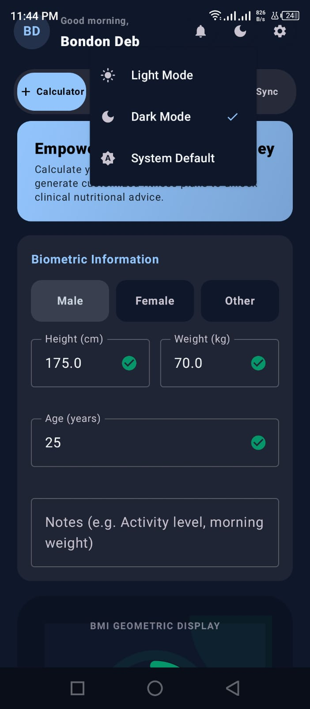

# 🏋️ BMI Fit Tracker


An Android-based **BMI & Fitness Tracker** application developed using **Kotlin** and **Jetpack Compose**. The app helps users calculate their Body Mass Index (BMI), monitor daily steps, save BMI history, export reports as PDF, and receive AI-powered health suggestions using **Google Gemini AI**.

---

# 📱 Features

- ✅ BMI Calculator
- ✅ BMI History
- ✅ Daily Step Counter
- ✅ Room Database
- ✅ PDF Report Export
- ✅ Gemini AI Health Suggestions
- ✅ Material Design UI
- ✅ Dark Mode Support
- ✅ MVVM Architecture
- ✅ Unit & UI Testing

---

# 🛠️ Tech Stack

| Technology | Usage |
|------------|-------|
| Kotlin | Programming Language |
| Jetpack Compose | UI Development |
| MVVM | Architecture |
| Room Database | Local Storage |
| Material 3 | UI Components |
| Google Gemini AI | AI Health Suggestions |
| Android Sensors | Step Counter |
| PDF Generator | Export Reports |

---

# 📂 Project Structure

```
BMI-Fit-Tracker
│
├── app
├── assets
├── gradle
├── README.md
├── build.gradle.kts
├── settings.gradle.kts
└── .gitignore
```

---

# 📸 App Screenshots

| Home | BMI Calculator |
|------|------|
|  |  |

| Fitness Goal | BMI History |
|------|------|
|  |  |

| AI Insights | Step Tracker |
|------|------|
|  |  |

### Theme Settings

<p align="center">
  
</p>

# ⚙️ Installation

### Clone Repository

```bash
git clone https://github.com/bondondeb/BMI-Fit-Tracker.git
```

Open the project in **Android Studio**.

Sync Gradle.

Run the application on an emulator or Android device.

---

# 📊 Architecture

```
UI (Jetpack Compose)
        │
        ▼
ViewModel
        │
        ▼
Repository
        │
        ▼
Room Database
```

---

# 🚀 Future Improvements

- User Authentication
- Cloud Backup
- Workout Planner
- Diet Planner
- Health Dashboard
- Wear OS Support

---

# 👨‍💻 Developer

**Bondon Deb**

Diploma in Computer Science & Engineering

Sylhet Polytechnic Institute

GitHub: https://github.com/bondondeb

---

# 📜 License

This project is licensed under the MIT License.

---

## ⭐ If you like this project, don't forget to Star the repository!
